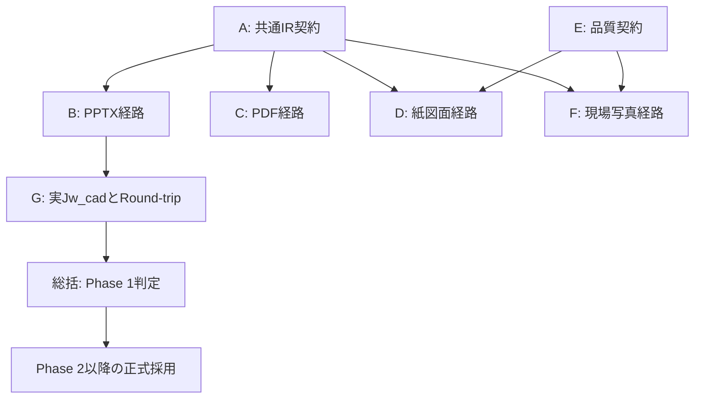

# 依存関係Map V1

監査は独立並行、製品接続はIRとPhase Gateに従う。実装完了を示す図ではない。

- A確定前: B/C/D/Fの監査、native inventory抽出設計、E品質設計、G試験計画は可能。
- A確定後: version/hashを指定したRoute adapterと物理unit exportを接続。
- phase採用: 1=PPTX、2=PDF、3=Paper、4=Quality高度化、5=Photo、6=Multi-view。先行監査やisolated prototypeは採用済みを意味しない。
- Gの実アプリ確認は制作担当のsynthetic/OOXML/DXF parse成功と分離。実操作未実施ならGate HOLD。
